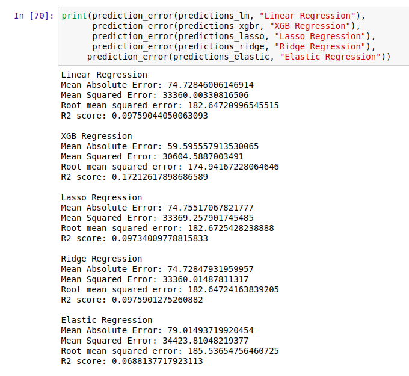

# Hackbout_Albatross
This repository is a part of [**Hackbout Hackathon**](https://www.hackbout.tech)

```
    void HackBout(){
        while (36Hrs){
            If (Alive){
                Print ("I ♥‿♥ Hacking at NMIT.");
            }
            else{
                drink_redbull (get_wings);
                continue;
            }
        }
    }
```

In this project we have worked on implementing the **Dynamic Pricing Strategies** into the E-commerce domain. In this project we have worked on **Airbnb open dataset** provided for the **New York city**.


## Steps for Implementation:
 - The Data source is taken from the open data published by Airbnb at their website.
 - The Data extracted and data wrangling is done to make the data clean and understandable to machine.
 - Exploratory Data Analysis(EDA) is performed using different graphical analysis to understand the insights from the data.
 - Feature Engineering is implemented on various features of the dataaset to get the importance of each feature present in the data.
 - Now the clean data is used to implement Machine Learning training to the various regerssion models and the final ouptut is the R2 score from each model.
 - Total of 5 Regression models have been implemented, out of which Elastic Regression Model showed the least Loss score and out-performed the other models.


## Final Result:



